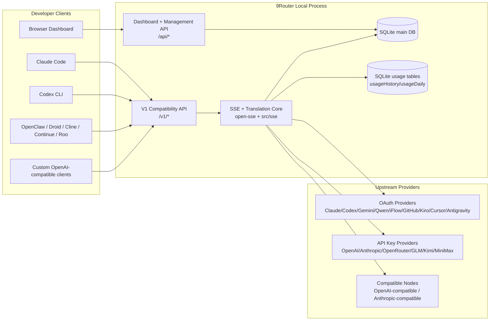
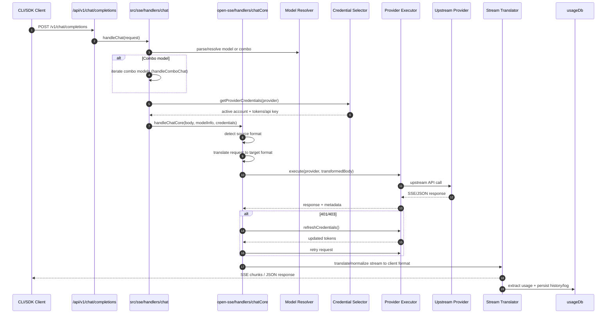
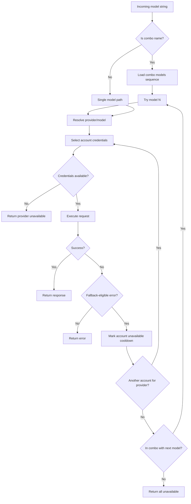
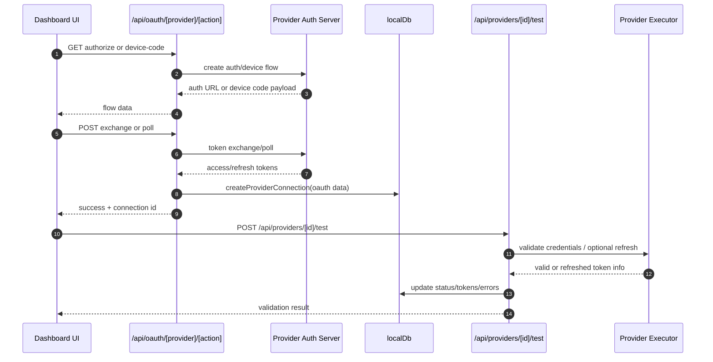
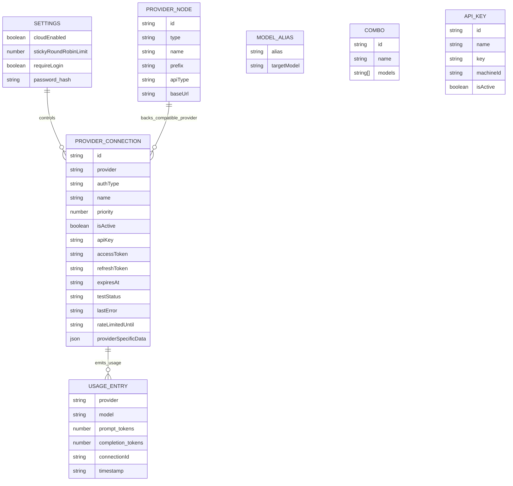
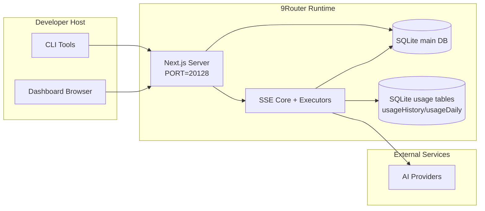

# 9Router Architecture

_Last updated: 2026-02-06_

## Executive Summary

9Router is a local AI routing gateway and dashboard built on Next.js.
It provides a single OpenAI-compatible endpoint (`/v1/*`) and routes traffic across multiple upstream providers with translation, fallback, token refresh, and usage tracking.

Core capabilities:

- OpenAI-compatible API surface for CLI/tools
- Request/response translation across provider formats
- Model combo fallback (multi-model sequence)
- Account-level fallback (multi-account per provider)
- OAuth + API-key provider connection management
- Local persistence for providers, keys, aliases, combos, settings, pricing
- Usage/cost tracking and request logging

Primary runtime model:

- Next.js app routes under `src/app/api/*` implement both dashboard APIs and compatibility APIs
- A shared SSE/routing core in `src/sse/*` + `open-sse/*` handles provider execution, translation, streaming, fallback, and usage

## Scope and Boundaries

### In Scope

- Local gateway runtime
- Dashboard management APIs
- Provider authentication and token refresh
- Request translation and SSE streaming
- Local state + usage persistence

### Out of Scope

- Provider SLA/control plane outside local process
- External CLI binaries themselves (Claude CLI, Codex CLI, etc.)

## High-Level System Context

## Core Runtime Components

## 1) API and Routing Layer (Next.js App Routes)

Main directories:

- `src/app/api/v1/*` and `src/app/api/v1beta/*` for compatibility APIs
- `src/app/api/*` for management/configuration APIs
- Next rewrites in `next.config.mjs` map `/v1/*` to `/api/v1/*`

Important compatibility routes:

- `src/app/api/v1/chat/completions/route.js`
- `src/app/api/v1/messages/route.js`
- `src/app/api/v1/responses/route.js`
- `src/app/api/v1/models/route.js`
- `src/app/api/v1/messages/count_tokens/route.js`
- `src/app/api/v1beta/models/route.js`
- `src/app/api/v1beta/models/[...path]/route.js`

Management domains:

- Auth/settings: `src/app/api/auth/*`, `src/app/api/settings/*`
- Providers/connections: `src/app/api/providers*`
- Provider nodes: `src/app/api/provider-nodes*`
- OAuth: `src/app/api/oauth/*`
- Keys/aliases/combos/pricing: `src/app/api/keys*`, `src/app/api/models/alias`, `src/app/api/combos*`, `src/app/api/pricing`
- Usage: `src/app/api/usage/*`
- CLI tooling helpers: `src/app/api/cli-tools/*`

## 2) SSE + Translation Core

Main flow modules:

- Entry: `src/sse/handlers/chat.js`
- Core orchestration: `open-sse/handlers/chatCore.js`
- Provider execution adapters: `open-sse/executors/*`
- Format detection/provider config: `open-sse/services/provider.js`
- Model parse/resolve: `src/sse/services/model.js`, `open-sse/services/model.js`
- Account fallback logic: `open-sse/services/accountFallback.js`
- Translation registry: `open-sse/translator/index.js`
- Stream transformations: `open-sse/utils/stream.js`, `open-sse/utils/streamHandler.js`
- Usage extraction/normalization: `open-sse/utils/usageTracking.js`

## 3) Persistence Layer

Primary state DB:

- `src/lib/localDb.js`
- file: `${DATA_DIR}/db.json` (or `~/.9router/db.json` when `DATA_DIR` is unset)
- entities: providerConnections, providerNodes, modelAliases, combos, apiKeys, settings, pricing

Usage DB:

- `src/lib/usageDb.js` (compat shim re-exporting `src/lib/db/repos/usageRepo.js`)
- tables: `usageHistory`, `usageDaily` in the main SQLite DB (follows `DATA_DIR`)

## 4) Auth + Security Surfaces

- Dashboard cookie auth: `src/proxy.js`, `src/app/api/auth/login/route.js`
- API key generation/verification: `src/shared/utils/apiKey.js`
- Provider secrets persisted in `providerConnections` entries
- Optional proxy support for upstream calls via env proxy variables (`open-sse/utils/proxyFetch.js`)

## Request Lifecycle (`/v1/chat/completions`)

## Combo + Account Fallback Flow

Fallback decisions are driven by `open-sse/services/accountFallback.js` using status codes and error-message heuristics.

## OAuth Onboarding and Token Refresh Lifecycle

Refresh during live traffic is executed inside `open-sse/handlers/chatCore.js` via executor `refreshCredentials()`.

## Data Model and Storage Map

Physical storage files:

- main state: SQLite DB at `${DATA_DIR}/db/data.sqlite` (or `~/.9router/db/data.sqlite`)
- usage stats: SQLite `usageHistory`/`usageDaily` tables in the main DB
- request log lines: `usageHistory` rows (surfaced via `getRecentLogs`; the legacy `appendRequestLog` is a no-op compat stub)
- optional translator/request debug sessions: `<repo>/logs/...`

## Deployment Topology

## Module Mapping (Decision-Critical)

### Route and API Modules

- `src/app/api/v1/*`, `src/app/api/v1beta/*`: compatibility APIs
- `src/app/api/providers*`: provider CRUD, validation, testing
- `src/app/api/provider-nodes*`: custom compatible node management
- `src/app/api/oauth/*`: OAuth/device-code flows
- `src/app/api/keys*`: local API key lifecycle
- `src/app/api/models/alias`: alias management
- `src/app/api/combos*`: fallback combo management
- `src/app/api/pricing`: pricing overrides for cost calculation
- `src/app/api/usage/*`: usage and logs APIs
- `src/app/api/cli-tools/*`: local CLI config writers/checkers

### Routing and Execution Core

- `src/sse/handlers/chat.js`: request parse, combo handling, account selection loop
- `open-sse/handlers/chatCore.js`: translation, executor dispatch, retry/refresh handling, stream setup
- `open-sse/executors/*`: provider-specific network and format behavior

### Translation Registry and Format Converters

- `open-sse/translator/index.js`: translator registry and orchestration
- Request translators: `open-sse/translator/request/*`
- Response translators: `open-sse/translator/response/*`
- Format constants: `open-sse/translator/formats.js`

### Persistence

- `src/lib/localDb.js`: persistent config/state
- `src/lib/usageDb.js`: usage history and rolling request logs

## Provider Executor Coverage

Specialized executors:

- `antigravity`
- `gemini-cli`
- `github`
- `kiro`
- `codex`
- `cursor`

Default executor path:

- all other providers (including compatible node providers) use `open-sse/executors/default.js`

## Format Translation Coverage

Detected source formats include:

- `openai`
- `openai-responses`
- `claude`
- `gemini`

Target formats include:

- OpenAI chat/Responses
- Claude
- Gemini/Gemini-CLI/Antigravity envelope
- Kiro
- Cursor

Translations are selected dynamically based on source payload shape and provider target format.

## Failure Modes and Resilience

## 1) Account/Provider Availability

- provider account cooldown on transient/rate/auth errors
- account fallback before failing request
- combo model fallback when current model/provider path is exhausted

## 2) Token Expiry

- pre-check and refresh with retry for refreshable providers
- 401/403 retry after refresh attempt in core path

## 3) Stream Safety

- disconnect-aware stream controller
- translation stream with end-of-stream flush and `[DONE]` handling
- usage estimation fallback when provider usage metadata is missing

## 5) Data Integrity

- DB shape migration/repair for missing keys
- corrupt JSON reset safeguards for localDb and usageDb

## Observability and Operational Signals

Runtime visibility sources:

- console logs from `src/sse/utils/logger.js`
- per-request usage aggregates in the SQLite `usageHistory` table
- request status history in `usageHistory` rows (`getRecentLogs`; no `log.txt` writer remains)
- optional deep request/translation logs under `logs/` when `ENABLE_REQUEST_LOGS=true`
- dashboard usage endpoints (`/api/usage/*`) for UI consumption

### Request-details store (`requestDetails`) and its bounds

While observability is enabled, `src/lib/db/repos/requestDetailsRepo.js`
buffers deep per-request records (sanitized headers, request/response bodies)
in memory and writes them to the SQLite `requestDetails` table in batches.
Four environment variables bound this pipeline. A value saved in dashboard
settings (`observability*` keys) always wins; the environment variable is the
fallback when no settings value is present. Config is re-read at most every
5 seconds.

| Variable | Default | Effect |
| --- | --- | --- |
| `OBSERVABILITY_MAX_RECORDS` | `200` | Retention cap. After each flush the table is trimmed back to this many rows by deleting the oldest `timestamp` entries first. Raise it to keep more inspection history; lowering it prunes the existing table on the next flush. |
| `OBSERVABILITY_BATCH_SIZE` | `20` | Flush threshold. Once this many records sit in the write buffer, a flush is triggered immediately instead of waiting for the interval timer. Higher values batch more writes per transaction; lower values make records visible in the dashboard sooner. |
| `OBSERVABILITY_FLUSH_INTERVAL_MS` | `5000` | Flush delay. Maximum time (milliseconds) an underrun buffer waits before flushing anyway. Any buffered records are lost if the process dies before a flush; on clean shutdown (`SIGINT`/`SIGTERM`/`exit`) the buffer is flushed once more. |
| `OBSERVABILITY_MAX_JSON_SIZE` | `5` (KB) | Per-field size cap in kilobytes. Each of the four JSON fields (`request`, `providerRequest`, `providerResponse`, `response`) is serialized and, when it exceeds `OBSERVABILITY_MAX_JSON_SIZE * 1024` bytes, stored truncated: `{ "_truncated": true, "_originalSize": ..., "_preview": <first 200 chars> }`. Note the env value is in **KB**, not bytes — the code multiplies by 1024. |

All four values are read through `parseInt`, so they must be integers.
Request/response headers are sanitized before storage regardless of these
bounds (`authorization`, `x-api-key`, `cookie`, `token`, `api-key` keys removed).

### Video proxy fetch timeout (`VIDEO_FETCH_TIMEOUT_MS`)

`open-sse/handlers/videoCore.js` transparently proxies async video jobs
(creation, edits, extensions, and status polling) to upstream video providers.
`VIDEO_FETCH_TIMEOUT_MS` sets the deadline, in milliseconds, for each upstream
HTTP round-trip — job submission and polling calls alike. Default `120000`
(2 minutes). It bounds only the network call: the video job itself renders
asynchronously upstream and is never subject to this timeout. The deadline is
applied via `AbortSignal.timeout` combined with the client's cancellation
signal. Video job creation is never auto-retried on network failure (the job
may already exist upstream); only a 401/403 credential refresh triggers a
single retry. Raise the value only when a video provider is known to answer
slowly; individual requests can also override it per call.

## Security-Sensitive Boundaries

- JWT secret (`JWT_SECRET`) secures dashboard session cookie verification/signing
- Initial password fallback (`INITIAL_PASSWORD`, default `123456`) must be overridden in real deployments
- API key HMAC secret (`API_KEY_SECRET`) secures generated local API key format
- Provider secrets (API keys/tokens) are persisted in local DB and should be protected at filesystem level
- Peer-token proof (`NINEROUTER_PEER_TOKEN`): the production wrapper `custom-server.js`
  derives the real client IP from the TCP socket and stamps it into `x-9r-real-ip`,
  stripping any client-supplied copy. Because a bare `next start`/`next dev` never loads
  the wrapper, code that reads that header first demands proof it was wrapper-stamped:
  the wrapper also generates a random 24-byte secret per process at boot and mirrors it
  into `x-9r-peer-token`; `src/lib/auth/trustedPeer.js` accepts `x-9r-real-ip` only when
  `x-9r-peer-token` matches the process' own secret (a client cannot guess it, and
  attacker-supplied copies of both headers are stripped before the handler runs). This
  gates client-IP trust for login rate-limiting (`src/lib/auth/loginLimiter.js`) and
  loopback checks in the dashboard guard (`src/dashboardGuard.js`).

  Operator implication: the variable is process-internal — set at boot, never read from
  `.env` (the wrapper overwrites any value it inherits), and never valid across restarts
  or between processes. Do not set it manually. Behind a reverse proxy, requests reach
  the wrapper over loopback and keep unspoofable IP attribution automatically; the
  supported way to declare an external proxy's `X-Forwarded-For` trustworthy is the
  separate `TRUST_PROXY=true` toggle, not a peer token. The `x-9r-peer-token` header is
  redacted by the request-details sanitizer before storage.

### Security environment variables

Operator-facing auth/security variables, consolidated (each source file is cited):

| Variable | Required | Default | Security effect |
|---|---|---|---|
| `JWT_SECRET` | **Yes** (real deploy) | `change-me-to-a-long-random-secret` | Signs/verifies dashboard session JWT cookies; rotation invalidates all sessions. `src/lib/auth/dashboardSession.js` |
| `INITIAL_PASSWORD` | **Yes** (real deploy) | `change-me` (in-box fallback `123456` only when the var is completely unset) | First-login dashboard password; enabled deployments disable the fallback. Rotation: set a new value. `src/app/api/auth/login/route.js` |
| `API_KEY_SECRET` | Recommended | `endpoint-proxy-api-key-secret` | HMAC secret for generated local API keys; rotation invalidates existing keys. `src/shared/utils/apiKey.js` |
| `MACHINE_ID_SALT` | Recommended | `endpoint-proxy-salt` | Salt for stable machine-id hashing (CLI token `x-9r-cli-token`). `src/shared/utils/machineId.js` |
| `REQUIRE_API_KEY` | Optional | `false` (stored setting default `true`) | API-key enforcement on the public LLM API — see the README env table. `src/lib/db/repos/settingsRepo.js` |
| `AUTH_COOKIE_SECURE` | Optional | `false` | Force `Secure` auth cookie — set `true` behind HTTPS. `src/lib/auth/dashboardSession.js` |
| `NINEROUTER_PEER_TOKEN` | **No — internal** | generated per process | Wrapper-stamped peer proof, never operator-facing (see above). `custom-server.js`, `src/lib/auth/trustedPeer.js` |
| `SHUTDOWN_SECRET` | Optional | unset | Bearer token for `POST /api/shutdown` in non-production (`401` if unset/mismatched; the route is `403` in production). `src/app/api/shutdown/route.js` |
| `ROUTER_API_KEY` | Optional | unset | API key the MITM proxy (`src/mitm/`) sends to the local router when a key is required. `src/mitm/handlers/base.js` |
| `TRUST_PROXY` | Optional | unset | `true` only behind a reverse proxy that overwrites `X-Forwarded-For` with the real client IP — enables XFF trust for login rate-limiting (never enable on direct exposure). `src/lib/auth/loginLimiter.js` |
| `KIMI_OAUTH_CLIENT_ID` | Optional | registry value | Kimi OAuth client-id override (forks). `src/lib/oauth/constants/oauth.js` |
| `KIMI_CODING_OAUTH_CLIENT_ID` | Optional | registry value | Kimi Code OAuth client-id override; takes precedence over `KIMI_OAUTH_CLIENT_ID`. Same file |

Rotation notes: `JWT_SECRET` rotation logs out every dashboard session; `API_KEY_SECRET`
and `MACHINE_ID_SALT` rotation invalidates existing generated keys / CLI tokens —
regenerate downstream credentials after rotating. Secrets stay in `.env`, never committed.

## Operator Control Surfaces: pxpipe, Headroom, Tunnel, Shutdown

These control routes drive host-level operations — package installs, managed child
processes, tunnel registration, and server shutdown. Access is decided centrally by the
dashboard guard (`src/proxy.js` matcher → `src/dashboardGuard.js`) before any route
handler runs. Three auth classes apply to the routes below:

- **Ordinary dashboard auth** — the deny-by-default rule for all `/api/*` paths
  (`src/dashboardGuard.js:244-249`): a valid session JWT cookie, a valid CLI token
  (`x-9r-cli-token`, machine-id derived, `src/dashboardGuard.js:8-21`), or
  `requireLogin === false` in settings (`src/dashboardGuard.js:201-206`).
- **Local-only + auth** — routes in `LOCAL_ONLY_PATHS` (`src/dashboardGuard.js:79-95`)
  additionally require the request itself to be local (`isLocalRequest`,
  `src/dashboardGuard.js:128-140`: loopback peer proven by the wrapper-stamped
  `x-9r-real-ip`, or the Host header in development only; a present `Origin` must also
  be loopback) or carry the CLI token (`canAccessLocalOnlyRoute`,
  `src/dashboardGuard.js:180-185`). Failure returns `403 "Local only: CLI token
  required"` (`src/dashboardGuard.js:227`).
- **Always protected** — `ALWAYS_PROTECTED` (`src/dashboardGuard.js:48-55`): only a
  valid JWT cookie or CLI token is accepted (`src/dashboardGuard.js:232-236`);
  `requireLogin === false` does NOT bypass this class.

List membership is prefix-matched (`pathname.startsWith`, `src/dashboardGuard.js:225`),
so `/api/headroom/proxy` covers the whole catch-all proxy subtree. Note:
`PROTECTED_API_PATHS` (`src/dashboardGuard.js:58-76`, which lists `/api/tunnel`) is
declared but never referenced by the guard's decision logic — it neither grants nor
restricts anything; the three classes above are the operative ones.

With `requireLogin === false`, ordinary-auth and local-only routes are reachable
without login (local-only ones still from loopback only); `/api/shutdown` alone still
demands a JWT cookie or CLI token.

### pxpipe (in-process transform library)

Library-mode pxpipe runs in the server process — start/stop/restart load or drop the
in-process module rather than managing a child process. Despite `install` running the
package installer on the host, no pxpipe route is in `LOCAL_ONLY_PATHS`
(`src/dashboardGuard.js:79-95`): all of them use ordinary dashboard auth.

| Route (`src/app/api/pxpipe/`) | Method(s) | Purpose and behavior | Auth class |
|---|---|---|---|
| `health` | `POST`, `GET` (alias, `route.js:16`) | Runs the pxpipe health check; GET exists so the dashboard card can probe on page load (`route.js:6-16`). | Ordinary |
| `install` | `POST` | Installs/reinstalls the package at `@latest`, drops any previously loaded module, re-runs the health check. `maxDuration = 300` — npm install can take minutes on a cold cache (`route.js:7-16`). | Ordinary |
| `logs` | `GET` | Install-log tail plus recent transform events; `?limit=N`, default 100, capped at 500 (`route.js:7-14`). | Ordinary |
| `restart` | `POST` | Unloads and reloads the in-process module — picks up an upgraded install without a server restart (`route.js:8-15`). | Ordinary |
| `start` | `POST` | Warms the in-process module ("start" in library mode). Auto-installs first when the package is missing and `pxpipeAutoInstall` is enabled; otherwise `409 NOT_INSTALLED` (`route.js:12-22`). `maxDuration = 300`. | Ordinary |
| `stats` | `GET` | Transform statistics; `?limit=N`, default 100, capped at 500 (`route.js:6-13`). | Ordinary |
| `status` | `GET` | Module status plus pxpipe settings (`enabled`, `autoInstall`, `minChars`, `timeoutMs`) (`route.js:7-17`). | Ordinary |
| `stop` | `POST` | Drops the in-process module; until started again, transform requests fail open to uncompressed passthrough (`route.js:7-15`). | Ordinary |

### Headroom (external compression proxy)

`start`, `stop`, and the catch-all `proxy` spawn/own host processes or proxy arbitrary
paths and are therefore local-only. `status`, `restart`, and `extras` are not in
`LOCAL_ONLY_PATHS` and use ordinary dashboard auth.

| Route (`src/app/api/headroom/`) | Method(s) | Purpose and behavior | Auth class |
|---|---|---|---|
| `status` | `GET` | Probes the configured Headroom URL (settings `headroomUrl` or the default) and reports the managed PID (`route.js:8-14`). | Ordinary |
| `start` | `POST` | Spawns the managed Headroom proxy process. Port comes from `headroomUrl` (default 8787); a non-loopback `headroomUrl` is refused with `400 EXTERNAL_PROXY` — external proxies must be started outside 9Router (`route.js:17-30`). | Local-only + auth |
| `stop` | `POST` | Stops the managed process; `409` when nothing was running (`route.js:6-10`). | Local-only + auth |
| `restart` | `POST` | Restarts the managed process with the same non-loopback `headroomUrl` refusal (`route.js:17-30`). Not listed in `LOCAL_ONLY_PATHS` — ordinary auth despite being process-affecting. | Ordinary |
| `extras` | `GET` | Lists available vs installed compression extras and the detected Python 3.10; `?log=1` returns the live install-log tail for progress polling (`route.js:7-21`). | Ordinary |
| `extras` | `POST` | Installs the requested extras (JSON body `{ "extras": [...] }`); `400` on `NOT_INSTALLED`/`NO_PYTHON` (`route.js:24-33`). | Ordinary |
| `extras` | `DELETE` | Uninstalls the requested extras (same body shape); `400` on `NO_PYTHON`/`INVALID_EXTRAS` (`route.js:36-45`). | Ordinary |
| `proxy/**` | `GET`, `POST`, `PUT`, `PATCH`, `DELETE`, `HEAD`, `OPTIONS` (`route.js:98-103`) | Reverse proxy to the configured Headroom URL. Forwards the caller's method and request body (`route.js:65-72`); strips hop-by-hop headers in both directions and deletes `cookie`/`authorization` unless the target host is loopback (`route.js:38-50`); does not follow redirects (`route.js:73`); rewrites `/dashboard` HTML `fetch('/…')` calls to the proxy prefix (`route.js:52-57`, `81-90`). | Local-only + auth |

### Tunnel (Cloudflare tunnel + Tailscale)

The tunnel control routes and all Tailscale routes are local-only — they spawn child
processes and read host secrets (`src/dashboardGuard.js:78-88`). `status` is read-only
probing and stays on ordinary dashboard auth.

| Route (`src/app/api/tunnel/`) | Method(s) | Purpose and behavior | Auth class |
|---|---|---|---|
| `status` | `GET` | Tunnel + Tailscale probe status behind a 3s coalescing cache (download progress stays live) (`route.js:4-20`). | Ordinary |
| `enable` | `POST` | Registers/starts the tunnel, restarts tunnel monitoring, then waits 8s for Cloudflare DNS warmup before responding (`route.js:6-16`). | Local-only + auth |
| `disable` | `POST` | Tears the tunnel down and updates monitoring (`route.js:6-16`). | Local-only + auth |
| `tailscale-check` | `GET` | Host probes: installed, custom/system daemon running, logged in, brew availability (macOS), cached sudo password; probes run in parallel with 1.5s timeouts (`route.js:37-50`). | Local-only + auth |
| `tailscale-install` | `POST` | Installs Tailscale and responds with a `text/event-stream` of `progress`/`done`/`error` events (`route.js:36-71`). The sudo password comes from the request body or the encrypted cached password; `400` when a password is required (non-Windows, non-brew platforms) and none is available (`route.js:17-31`). | Local-only + auth |
| `tailscale-enable` | `POST` | Starts Tailscale and reconfigures monitoring (`route.js:6-16`). | Local-only + auth |
| `tailscale-disable` | `POST` | Stops Tailscale and updates monitoring (`route.js:6-16`). | Local-only + auth |

### Shutdown

- `POST /api/shutdown` (`src/app/api/shutdown/route.js:4`) — **always protected**: the
  only route in this section on the `ALWAYS_PROTECTED` list (`src/dashboardGuard.js:48-55`,
  gate at `src/dashboardGuard.js:232-236`); a valid session JWT cookie or CLI token is
  required, and `requireLogin === false` does not bypass it. The handler adds its own
  layers: `403` when `NODE_ENV === "production"` (deliberately disabled in production,
  `route.js:5-7`), and outside production an `Authorization: Bearer $SHUTDOWN_SECRET`
  header (`401` when the variable is unset or mismatched, `route.js:9-14`). On success
  the Node process exits about 500 ms after the response is sent (`route.js:18-20`).

### Updater / self-host lifecycle variables

Used by the in-app self-update flow (`src/lib/appUpdater.js` → detached updater process
`src/lib/updater/updater.js`). The Next server spawns the updater, exits, the updater runs
`npm i -g <pkg>@latest` and can relaunch the app. Most `UPDATER_*` values are **injected by
`appUpdater.js` from `UPDATER_CONFIG`** (`src/shared/constants/config.js`); the env vars are
override points for self-host/packaged deployments, not usually hand-set.

| Variable | Default | Effect |
|---|---|---|
| `UPDATER_PKG_NAME` | `9router` | npm package the updater installs (`npm i -g <pkg>@latest --prefer-online`). |
| `UPDATER_PORT` | `20129` | Loopback-only status HTTP port the updater serves `/update/status` on (browser polls it while the Next server is down). |
| `UPDATER_APP_PORT` | `20128` | App port the updater probes to detect when the old server has exited (before install) and the new one is up (before reopening the dashboard). |
| `UPDATER_TAIL_LINES` | `8` | How many npm output lines are kept in the status `logTail` (and written to `<DATA_DIR>/update/install.log`). |
| `UPDATER_RETRIES` | `3` | Install attempts before the updater reports failure. |
| `UPDATER_RETRY_DELAY_MS` | `5000` | Delay between failed install attempts. |
| `UPDATER_LINGER_MS` | `30000` | How long the updater stays alive after finishing so the browser can read the final status. |
| `UPDATER_WAIT_MIN_MS` | `5000` | Minimum wait before install (OS file-handle release; matters on Windows). |
| `UPDATER_WAIT_MAX_MS` | `20000` | Max wait for the app port to go free before proceeding anyway. |
| `UPDATER_WAIT_CHECK_MS` | `500` | App-port poll interval during the wait phase. |
| `UPDATER_SCRIPT_PATH` | *(resolved)* | Explicit path to `updater.js` when auto-resolution (cwd, `cwd/../src/lib/updater/`) fails. |
| `UPDATER_RELAUNCH` | *(set by spawner)* | `"1"` enables relaunching the app after a successful install. Inert when unset. |
| `UPDATER_RELAUNCH_CMD` | `npx` | Command used for the relaunch (resolved to `npx.cmd` on Windows). |
| `UPDATER_RELAUNCH_ARGS` | `["9router", "--skip-update"]` | JSON-array relaunch args; tray mode appends `--tray`. Cleared in the child env to prevent relaunch loops. |

Related (same lifecycle surface, read directly from the environment):

| Variable | Default | Effect |
|---|---|---|
| `TRAY_MODE` | *(unset)* | `"1"` marks the app as tray-launched; the updater relaunches with `--tray --skip-update` so tray stays tray. Set by the tray wrapper. |
| `LOG_LEVEL` | `INFO` | SSE/cloud logger verbosity (`src/sse/utils/logger.js`): `DEBUG`, `INFO`, `WARN`, `ERROR` (case-insensitive; invalid values fall back to `INFO`). Errors always print regardless of level. |
| `DISABLE_BACKGROUND_TOKEN_REFRESH` | *(unset)* | Any truthy value disables the background provider-token refresh loop (`src/sse/services/backgroundTokenRefresh.js`) — useful in CI, tests, or single-shot runs. |

## Environment and Runtime Matrix

Environment variables actively used by code:

- App/auth: `JWT_SECRET`, `INITIAL_PASSWORD`
- Storage: `DATA_DIR`
- Security hashing: `API_KEY_SECRET`, `MACHINE_ID_SALT`
- Logging: `ENABLE_REQUEST_LOGS`, `LOG_LEVEL` (SSE/cloud logger verbosity)
- Observability bounds: `OBSERVABILITY_MAX_RECORDS`, `OBSERVABILITY_BATCH_SIZE`,
  `OBSERVABILITY_FLUSH_INTERVAL_MS`, `OBSERVABILITY_MAX_JSON_SIZE` (request-details
  store; dashboard settings override — see the Observability section above)
- Process-internal peer proof: `NINEROUTER_PEER_TOKEN` (set by `custom-server.js`,
  not operator-facing)
- Video proxy: `VIDEO_FETCH_TIMEOUT_MS` (upstream fetch deadline, `open-sse/handlers/videoCore.js`)
- Base URL matching: `BASE_URL`, `CLOUD_URL`, `NEXT_PUBLIC_BASE_URL`, `NEXT_PUBLIC_CLOUD_URL`
- Outbound proxy: `HTTP_PROXY`, `HTTPS_PROXY`, `ALL_PROXY`, `NO_PROXY` and lowercase variants
- Platform/runtime helpers (not app-specific config): `APPDATA`, `NODE_ENV`, `PORT`, `HOSTNAME`

## Known Architectural Notes

1. `usageDb` currently stores under `~/.9router` and does not follow `DATA_DIR`.
2. `/api/v1/route.js` returns a static model list and is not the main models source used by `/v1/models`.
3. Request logger writes full headers/body when enabled; treat log directory as sensitive.
4. Base URL matching depends on the configured base URL variables; federation routing uses the dedicated federation configuration described in `docs/federation-spec.md`.

## Operational Verification Checklist

- Build from source: `cd /root/dev/9router && npm run build`
- Build Docker image: `cd /root/dev/9router && docker build -t 9router .`
- Start service and verify:
- `GET /api/settings`
- `GET /api/v1/models`
- CLI target base URL should be `http://<host>:20128/v1` when `PORT=20128`
